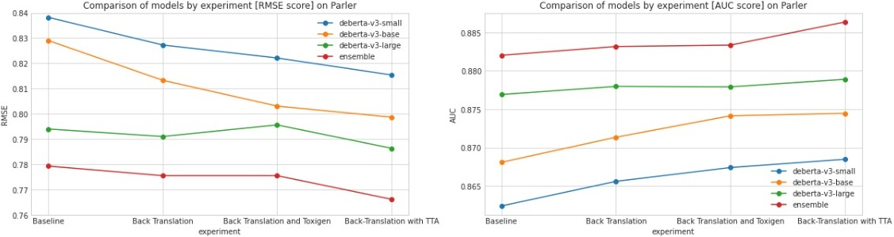
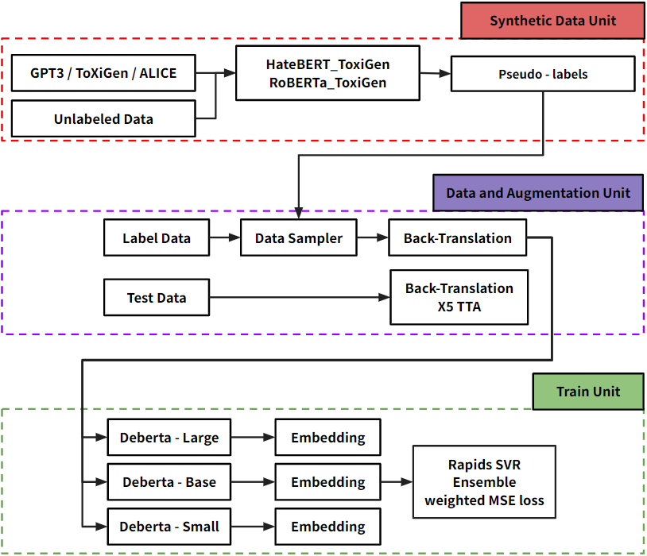
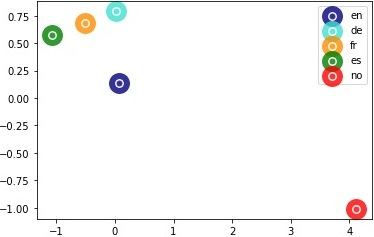
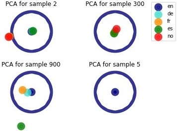
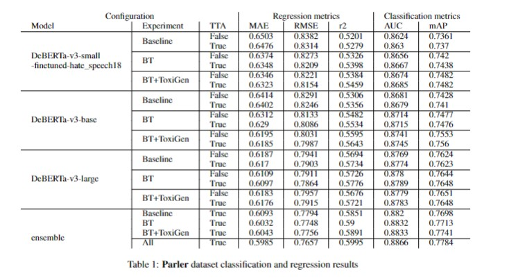
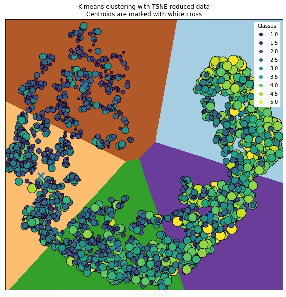
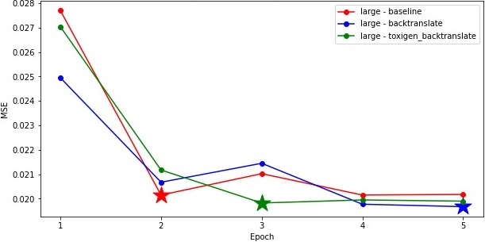

# Social Network Hate Detection: Finding Social Media Posts Containing Hateful Information Using Ensemble Methods and Back-Translation
<p align="center" width="100%">
     
</p>
Recent research efforts have been directed toward the development of automated systems for detecting hateful content to assist social media providers in identifying and removing such content before it can be viewed by the public. This paper introduces a unique ensemble approach that utilizes DeBERTa models, which benefits from pre-training on massive synthetic data and the integration of back-translation techniques during training and testing. Our findings reveal that this approach delivers state-of-the-art results in hate-speech detection. The results demonstrate that the combination of back-translation, ensemble, and test-time augmentation results in a considerable improvement across various metrics and models in both the Parler and GAB datasets. We show that our method reduces models’ bias in an effective and meaningful way, and also reduces the RMSE from 0.838 to around 0.766 and increases R-squared from 0.520 to 0.599. The biggest improvement was seen in small Deberate models, while for large models, there was either a minor improvement or no change.

## Pipline
<p align="center" width="100%">
     
</p>

## Back-Translation
The process of determining the optimal languages for back-translation involved selecting a set of initial languages and then choosing only the ones can produce most beneficial augmented data for our specific task. First, the original sentences were transformed into different languages. Then, we ran the augmented sentences through a pre-trained model and used embedding techniques to find the distance between the original and the augmented sentences. Finally, the embeddings were used to determine which of the chosen language translations generated sentences that are most similar to the original sentences. The embedding methods that were tested are: PCA, LDA, and t-SNE. After testing these three methods, it was found that tSNE (Figure 2) produced the most accurate results, and was therefore the only method that was used in the final training configuration. This approach was most effective when the language that were initially selected had similar language characteristics and sentence structure

<p align="center" width="100%">
     
</p>

## Test Time Augmentation
We introduced an extra TTA layer to the model. Although TTA can be applied to any form of data, its adoption in NLP has been limited due to the challenge of finding label-preserving transformations. Our back-translation technique was also utilized as a TTA tool. In addition to the original sentence or data, we included all relevant back-translated sentences, filtering out non-related languages us- Figure 3: Parler dataset experiment results. Left: Regression results (RMSE), right: Classification results (AUC) ing the embedding layer (Figure 4). The original sentence was assigned a weight of 0.7, with the remaining weight of 0.3 divided among the included back-translated sentences. During the test we checked which languages allow to get a maximum result and we found the distance range from the source language. The technique allows us to determine which back translations will enter to the TTA per row. for example, In sample 2, it can be seen that the only two language entered into test - the source language and Spanish because all other languages are not within the range. On the other hand, in sample 300, all languages entered the test. In case 900 only 3 languages were chosen while in sample 5 all the reverse translations were very far from the source language which can indicate problems in labeling / sentence such as using multiple emojis or slang language

<p align="center" width="100%">
     
</p>

## Ensemble
Combining various models and experiments, weaimed to improve prediction accuracy through ensemble methods. This method leverages the strengths of different models, such as diverse linguistic features, and minimizes their limitations/overfitting. Common ensemble techniques in NLP include model averaging, voting, and stacking, and can be applied to tasks like text classification, machine translation, and named entity recognition. The objective of using ensemble methods is to reduce model variance. This study compared three ensemble methods: simple averaging, weighted averaging based on AUC results, and LightGBM using predictions as input. The best performing ensemble method was determined to be simple averaging applied to the dataset
## Results

<p align="center" width="100%">
     
</p>
<p align="center" width="100%">
     
</p>
<p align="center" width="100%">
     
</p>
## pre-train models

https://huggingface.co/OrK7/parler_hate_speech

## Install
clone our repo
```
git clone https://github.com/OrKatz7/parler-hate-speech
cd parler-hate-speech
```
install fastText
```
git clone https://github.com/facebookresearch/fastText.git
cd fastText
pip install .
cd ..
```
install requirements
```
pip install -U easynmt
pip install thai-segmenter
pip install -U protobuf==3.20.0
pip install -U iterative-stratification==0.1.7
pip install -U transformers==4.21.2
pip install -U tokenizers==0.12.1
```
export
```
export PROTOCOL_BUFFERS_PYTHON_IMPLEMENTATION=python
```
## How To Run
clasic tf-idf
```
train-tfidf.ipynb
```
back translation
```
back_translation.ipynb
```
train
```
Toy example - train simple NN like Bert, Robereta or Deberta from Hugging Face - train_nn.ipynb
```
full train regression task:
```
csv_path = "{datasets}.csv" #change to csv path (csv format #id,text,label_mean)
model = microsoft/deberta-v3-large #microsoft/deberta-v3-base #microsoft/deberta-v3-small
python main.py --model $model --outputs_dir ./outputs/toxigen_backtranslate_reg/ --back_translation --pretrain_hate --csv_path $csv_path
python main.py --model $model --outputs_dir ./outputs/backtranslate_reg/ --back_translation --csv_path $csv_path
python main.py --model $model --outputs_dir ./outputs/baseline_reg/ --csv_path $csv_path
```

full train classification task:
```
csv_path = "{datasets}.csv" #change to csv path (csv format #id,text,label_mean)
model = microsoft/deberta-v3-large #microsoft/deberta-v3-base #microsoft/deberta-v3-small
python main.py --model $model --outputs_dir ./outputs/toxigen_backtranslate_cla/ --back_translation --pretrain_hate --csv_path $csv_path --classification
python main.py --model $model --outputs_dir ./outputs/backtranslate_cla/ --back_translation --csv_path $csv_path --classification
python main.py --model $model --outputs_dir ./outputs/baseline_cla/ --csv_path $csv_path --classification
```
stage 2 - train lgbm
```
train a lgbm model on Hugging Face{Bert,Roberta or Deberta} embeddings - stage2train.ipynb
```
